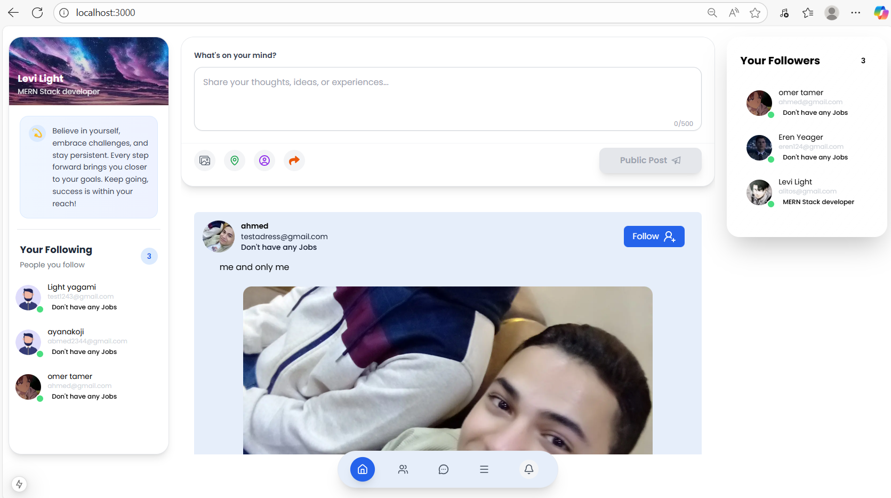
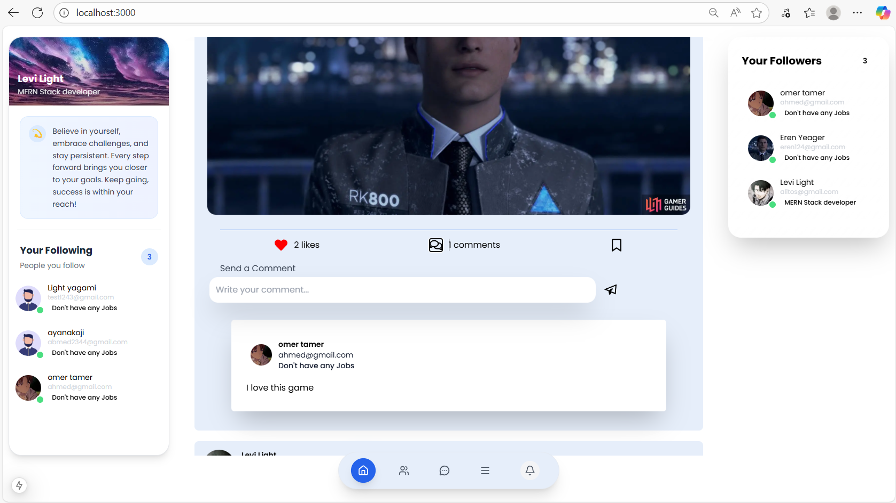
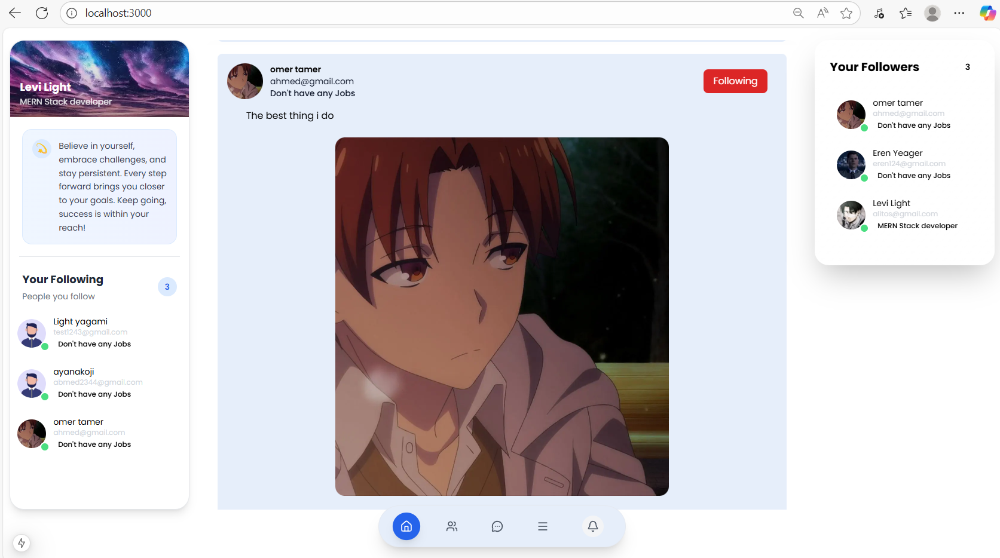
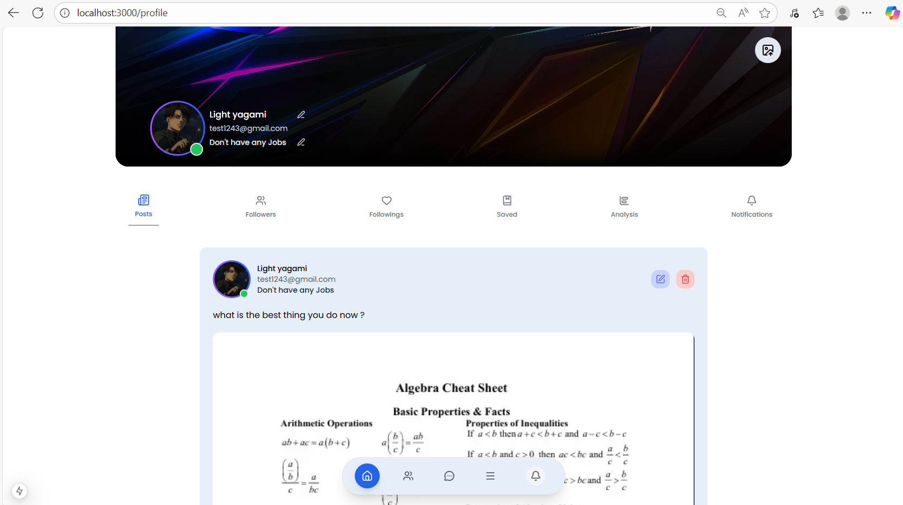
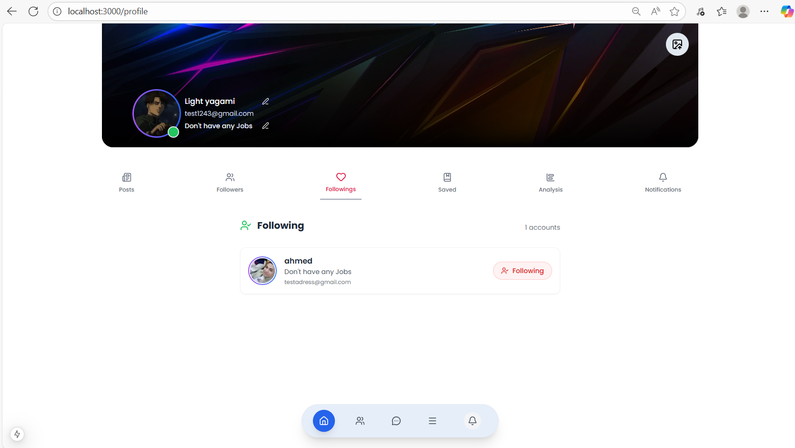
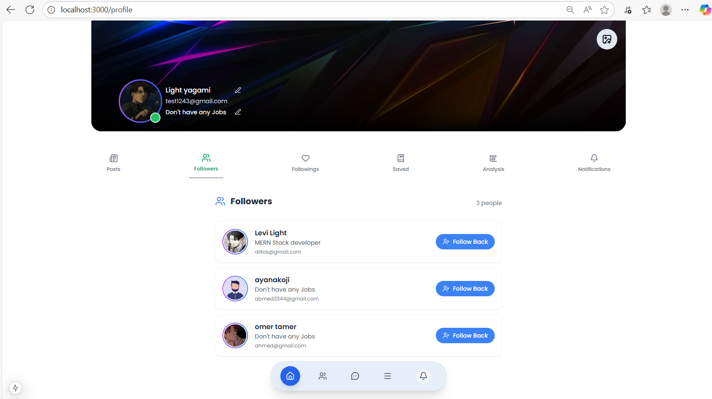
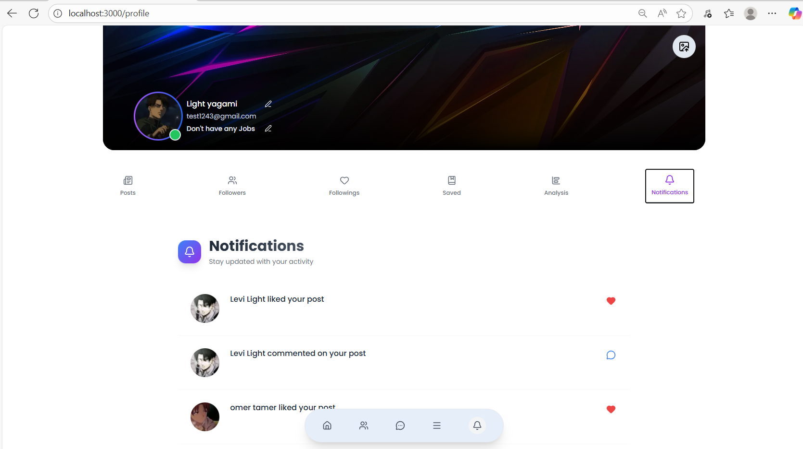
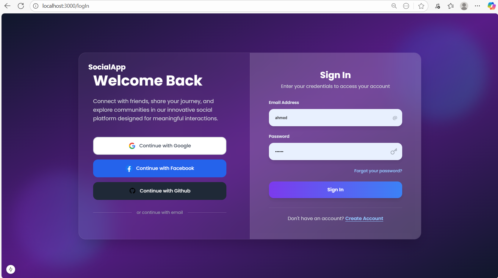
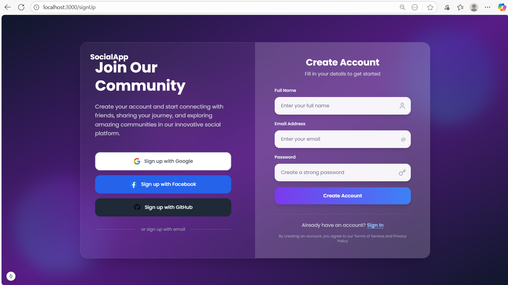

# USMP - Ultimate Social Media Platform
---
Ultimate Social Media App is the place you can share your ideas very easily and connect with your friends and follow them, built with the MERN Stack technology.

## Table of Contents
- [Features](#features)
- [Technologies](#technologies)
- [Installation](#installation)
- [Run Locally](#run-locally)
- [API Endpoints](#api-endpoints)
- [Environment Variables](#environment-variables)
- [Project Structure](#project-structure)
- [Screenshots](#screenshots)
- [Contributing](#contributing)
- [License](#license)

## Features
---

###  Authentication & Security
- JWT-based authentication
- Secure password hashing with bcrypt
- Protected routes and API endpoints

###  User Management
- User registration and login
- Profile customization (avatar, bio, personal info)
- Follow/Unfollow system

###  Social Features
- Create, edit, and delete posts
- Like and comment on posts
- Real-time notifications
- Followers/Following system
- News feed with personalized content

###  Media Handling
- Image upload and optimization
- Avatar customization
- Post media attachments

## Technologies

### Frontend
- **Next.js 15** - React framework with App Router
- **TypeScript** - Type safety and better development experience
- **Tailwind CSS** - Utility-first CSS framework
- **React Hook Form** - Form handling and validation
- **React Icons && Lucide Icons** - Icon library

### Backend
- **Node.js** - Runtime environment
- **Express.js** - Web framework
- **MongoDB** - NoSQL database
- **Mongoose** - ODM for MongoDB
- **JWT** - Authentication tokens
- **bcrypt** - Password hashing
- **Multer** - File upload handling
- **Socket.io** - Real-time communication

### Deployment & Tools
- **Docker** - Containerization
- **Vercel** - Frontend deployment
- **AWS/Heroku** - Backend deployment
- **Git** - Version control
- **Postman** - API testing

## Installation

### Prerequisites
- Node.js (v18 or higher)
- MongoDB (v6 or higher)
- npm or yarn

### Steps


1. **Clone the repository**
   ```bash
   git clone https://github.com/Ahmed-175/USMP.git
   cd usmp
   ```

2. **Install dependencies**
   ```bash
   # Install backend dependencies
   npm install

   # Install frontend dependencies
   cd ./frontend
   npm install
   ```

3. **Environment Setup**
   Create `.env` files in both frontend and backend directories:

   **Backend (.env)**
   ```env
   PORT=5000
   MONGODB_URI=mongodb://localhost:27017/usmp
   ```

   **Frontend (.env.local)**
   ```env
   SEVER_URL=http://localhost:5000

   ```

4. **Start the development servers**
   **Backend**
   ```bash
   npm run server
   ```

   **Frontend**
   ```bash
   npm run dev
   ```

## Run Locally
The application will be available at:
- Frontend: http://localhost:3000
- Backend API: http://localhost:5000


## Project Structure


### Home Page



### User Profile





### Login Page 

### Sign Up Page 

